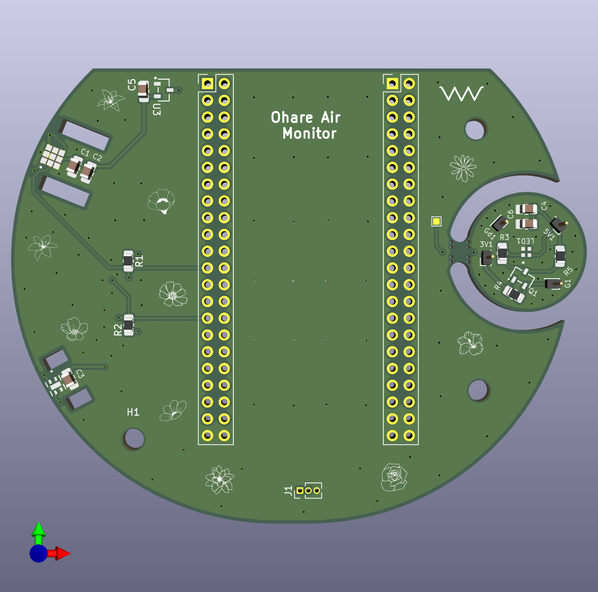
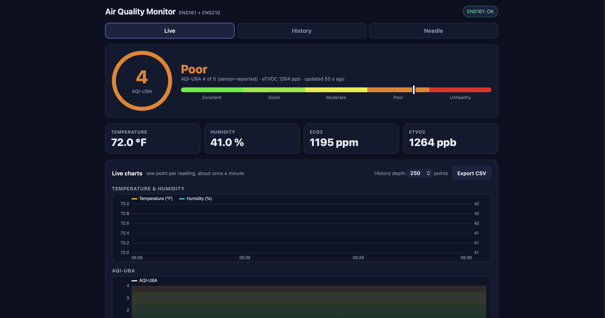
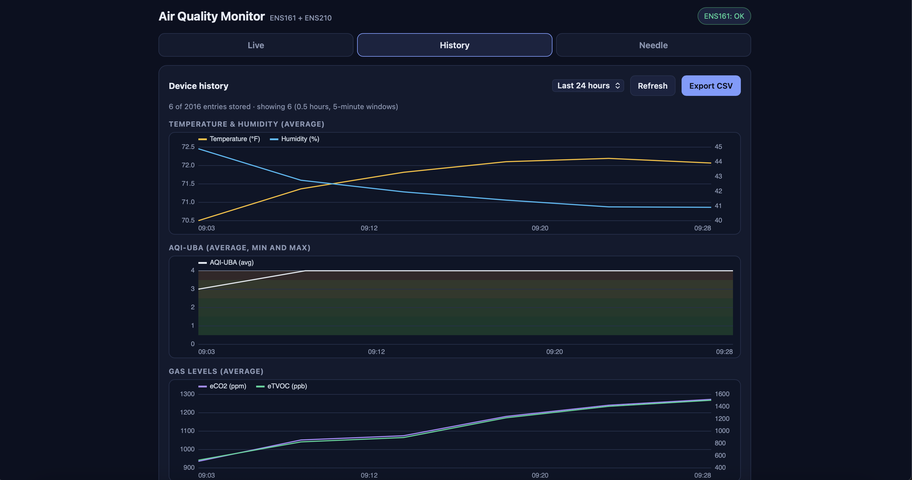
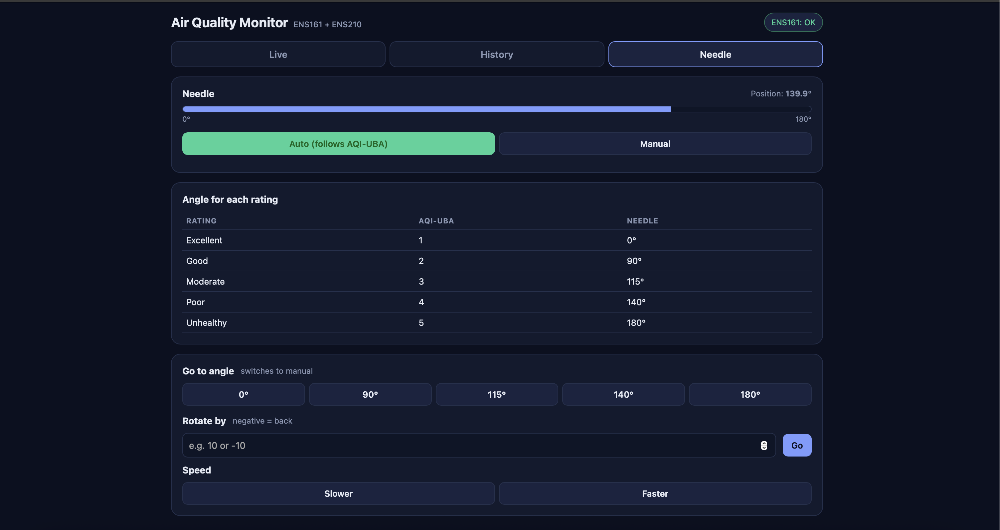

# O'Hare Air


A desktop air quality monitor shaped like a flower. It watches temperature, humidity, and air quality (eCO2/eTVOC/AQI-UBA) with a ScioSense ENS161 + ENS210, points a physical stepper-driven needle at the current rating, glows green-to-red through an RGB LED, and serves a full live dashboard over Wi-Fi with history and CSV export. No app, no cloud, no account.

---

## Where the name comes from

The name is taken from The Lorax (2012). In the film, Aloysius O'Hare is the mayor of Thneedville and the founder/CEO of "O'Hare Air," a company that sells bottled air to the town after industrial pollution ruined the natural air supply. This project borrows the name "O'Hare Air" for a device that measures real air quality.

---

## Table of contents

- [Features](#features)
- [How it all fits together](#how-it-all-fits-together)
- [Hardware — two PCB generations](#hardware--two-pcb-generations)
  - [V1 — ESP32-S3 dev-board shield](#v1--esp32-s3-dev-board-shield)
  - [V2 — custom ESP32-H2 module board](#v2--custom-esp32-h2-module-board)
  - [V1 vs V2 at a glance](#v1-vs-v2-at-a-glance)
- [Firmware](#firmware)
  - [Startup and timing](#startup-and-timing)
  - [How air quality is measured and calculated](#how-air-quality-is-measured-and-calculated)
  - [Temperature and humidity](#temperature-and-humidity)
  - [The needle](#the-needle)
  - [The LED](#the-led)
  - [History logging](#history-logging)
- [The web dashboard](#the-web-dashboard)
- [Flashing it yourself](#flashing-it-yourself)
- [Repository layout](#repository-layout)
- [Known limitations](#known-limitations)

---

## Features

- **Real air-quality sensing**: ScioSense ENS161 (eTVOC, eCO2, and an onboard 1-5 AQI-UBA rating) plus an ENS210 for temperature and humidity.
- **A physical gauge**: a 28BYJ-48 stepper motor sweeps a needle from 0° to 180° across five ratings: Excellent, Good, Moderate, Poor, Unhealthy.
- **A living LED**: a smooth green-to-red gradient that tracks the current rating, and a slow blue pulse while the sensor is still warming up.
- **A full web dashboard**: live readings, up to seven days of on-device history with min/avg/max, CSV export, and manual needle/LED control, all served directly from the board over Wi-Fi.
- **Two hardware generations**: a shield that plugs onto an off-the-shelf ESP32-S3 dev board (V1), and a from-scratch, coin-sized board built around a bare ESP32-H2 module (V2).
- **A 3D-printed flower enclosure**, because an air monitor sitting on your desk should look like it belongs there.

---

## How it all fits together

```
        ENS210 (temp/RH) ──┐
                            ├──► ESP32 ──► 28BYJ-48 stepper ──► needle (0°-180°)
        ENS161 (AQI-UBA,   ─┘      │
        eTVOC, eCO2)               ├──► RGB LED (green → yellow → orange → red)
                                    │
                                    └──► Wi-Fi ──► built-in web dashboard
                                              (Live / History / Needle tabs)
```

Both sensors sit on the same I2C bus. Every reading cycle, the firmware pulls temperature and humidity from the ENS210, feeds them to the ENS161 as environmental compensation (metal-oxide gas sensors need to know how hot and humid the air is to interpret resistance changes correctly), then reads the ENS161's eTVOC, eCO2, and AQI-UBA registers. AQI-UBA, the sensor's own 1-5 classification, is what drives the needle and the LED. Everything is also pushed out over the board's Wi-Fi web server so it's watchable from a phone or laptop in real time.

---

## Hardware — two PCB generations

### V1 — ESP32-S3 dev-board shield



V1 is a **shield**: a round board with two 2×22 headers (`J9`/`J10`) that plug directly onto an **ESP32-S3-DevKitC-1** dev board, using its pinout exactly. Rather than design a whole MCU circuit, V1 borrows the dev board's regulator, USB-to-serial bridge, and antenna, so the custom PCB only has to carry the sensors, the LED driver, and a 1.8 V rail.

**On the shield itself:**

| Ref | Part | Purpose |
|---|---|---|
| U1 | ENS161-BLGT | Air quality sensor (I2C `0x52`), eTVOC, eCO2, AQI-UBA |
| U2 | ENS210-LQFM | Temperature/humidity sensor (I2C `0x43`) |
| U3 | MCP1700T-1802E | Linear regulator, 3.3 V → 1.8 V for the ENS161's `VDD` rail |
| R1, R2 | 10 kΩ | I2C pull-ups (SCL/SDA) |
| C1–C6 | 0.1 µF / 10 µF | Decoupling for the sensors and the LED |
| Q1 | BSS138 | N-MOSFET level shifter, 3.3 V logic → 5 V for the LED data line |
| LED1 | IN-PI15TAT5R5G5B | A single addressable RGB LED |
| J1 | 3-pin socket | Breaks out 5 V / 3.3 V / LED data for the LED module |
| H1–H3, TP1 | — | Mounting holes and a test point |

The two headers expose every GPIO the dev board offers, but the sketch only actually uses a handful of them: `GPIO8`/`GPIO9` for I2C, `GPIO4`–`GPIO7` for the stepper's four ULN2003 driver inputs, and `GPIO48` for the dev board's own onboard RGB LED. 

Full schematic: [`OhareV1PCB/OhareV1Sch.pdf`](OhareV1PCB/OhareV1Sch.pdf). Manufacturing files (Gerbers) are in [`OhareV1PCB/Gerber.zip`](OhareV1PCB/Gerber.zip); KiCad source is [`OhareV1.kicad_pcb`](OhareV1PCB/OhareV1.kicad_pcb) / [`OhareV1.kicad_sch`](OhareV1PCB/OhareV1.kicad_sch).

### V2 — custom ESP32-H2 module board


V2 throws out the dev board entirely. Instead of two headers plugging into someone else's board, V2 puts an **ESP32-H2-MINI-1** module (a tiny, low-power Espressif module, not a full development board) directly on the PCB, along with its own USB-C connector and its own power regulation. The result is dramatically smaller: the whole "computer" fits in the footprint of the module itself, not a full dev-board-shaped hole in the middle of the design.

**On the V2 board:**

| Ref | Part | Purpose |
|---|---|---|
| U7 | ESP32-H2-MINI-1 | The microcontroller: BLE + 802.15.4 (Zigbee/Thread) radio, **no Wi-Fi** (see below) |
| U2 | ENS161 | Air quality sensor (I2C `0x52`) |
| U10 | ENS210 | Temperature/humidity sensor (I2C `0x43`) |
| U6 | AP2205 | 3.3 V regulator (the board's main "3V3 bus") |
| U5 | AP2120 | 1.8 V regulator, for the ENS161's `VDD` |
| P1 | USB-C receptacle | Power and native USB flashing (the H2 has built-in USB, no separate USB-serial chip needed) |
| D5 | TPD1E10B06 | ESD/surge protection on the USB data lines |
| R21, R22 | 5.1 kΩ | USB-C CC pull-downs, so the board correctly identifies itself as a 5 V sink to chargers and power banks |
| Q1 | BSS138 | Same level-shifting job as V1: 3.3 V logic to 5 V LED data |
| LED1, LED2, LED3 | IN-PI15TAT5R5G5B | **Three** addressable RGB LEDs (labeled Front Left / Front Right / Rear Right on the silkscreen), daisy-chained, instead of V1's single LED |
| S2 | Push button | BOOT (bootloader entry for flashing) |
| S3 | Push button | Reset |

Full schematic: [`OhareV2PCB/OhareV2Sch.pdf`](OhareV2PCB/OhareV2Sch.pdf); KiCad source is [`OhareV2.kicad_pcb`](OhareV2PCB/OhareV2.kicad_pcb) / [`OhareV2.kicad_sch`](OhareV2PCB/OhareV2.kicad_sch).

### V1 vs V2 at a glance

| | V1 | V2 |
|---|---|---|
| MCU | ESP32-S3-DevKitC-1 (full dev board, plugged in via headers) | ESP32-H2-MINI-1 (bare module, soldered directly to the PCB) |
| Radio | Wi-Fi + BLE | BLE + 802.15.4 (Zigbee/Thread); no Wi-Fi |
| Size | Dev-board-sized | A fraction of that; the module is the board |
| Power in | Through the dev board's own USB-C | Native USB-C directly on the PCB |
| LEDs | 1 (drives the dev board's onboard LED) | 3, individually placed under the enclosure's petals |
| Flashing | Dev board's onboard USB-to-serial bridge | Native USB on the H2 itself |
| Firmware status | **Fully supported**, this is what the current sketch targets | **Current firmware is supported on new version |

---

## Firmware

The active firmware is [`Code/OhareAir/OhareAir.ino`](Code/OhareAir/OhareAir.ino), an Arduino sketch built for the **ESP32-S3 (V1)**. It's written directly against the ENS161 and ENS210 datasheets: talking to both sensors over I2C, driving the stepper needle and RGB LED, and serving the whole web dashboard, all from a single self-contained sketch.

### Startup and timing

On power-up, both sensors initialize immediately, but **nothing is read for the first 3 minutes.** The ENS161 needs that long to reach a stable operating temperature; reading it earlier just produces noise. During this warm-up the LED pulses a slow blue instead of showing a color it can't back up yet, and the needle stays parked at 0°.

Once warm-up ends, the firmware takes **one reading per minute**. A flower on a desk doesn't need second-by-second air-quality updates, and a slower cadence keeps the I2C bus quieter.

Each reading cycle:
1. Read temperature and humidity from the ENS210.
2. Write those values to the ENS161's compensation registers (`TEMP_IN` / `RH_IN`), so its gas readings account for the current conditions.
3. Give the ENS161 a moment to fold that compensation into its next internal measurement.
4. Read eTVOC, eCO2, and AQI-UBA off the ENS161.
5. Feed everything into the 5-minute history accumulator.
6. If Auto mode is on, hand AQI-UBA to the needle logic.

### How air quality is measured and calculated

The ENS161 is a metal-oxide gas sensor: it doesn't count individual VOC molecules, it measures how much a heated sensing element's electrical resistance shifts when exposed to reactive gases, then converts that into three numbers over I2C:

- **eTVOC** (equivalent Total Volatile Organic Compounds, in ppb): the chip's estimate of total VOC concentration, calibrated against ethanol as a reference gas. This is the sensor's actual measurement; everything else is derived from it.
- **eCO2** (equivalent CO2, in ppm): not a real CO2 measurement. It's estimated from the same VOC signal, so it tracks eTVOC almost exactly and should be read as "how stale does the air smell," not literal CO2 concentration.
- **AQI-UBA** (1-5): the chip's own onboard hygienic rating, computed internally by ScioSense's proprietary algorithm from its eTVOC signal, using threshold bands published by Germany's Federal Environmental Agency (Umweltbundesamt, hence "UBA"):

  | AQI-UBA | Rating | Approx. eTVOC |
  |---|---|---|
  | 1 | Excellent | 0 – 65 ppb |
  | 2 | Good | 65 – 220 ppb |
  | 3 | Moderate | 220 – 650 ppb |
  | 4 | Poor | 650 – 2,200 ppb |
  | 5 | Unhealthy | 2,200 ppb+ |

**AQI-UBA is what drives the needle and the LED**, rather than a hand-built formula. eTVOC and eCO2 are still read, displayed, and logged, but the rating itself comes straight from the ENS161's own proprietary onboard algorithm: ScioSense's classification, computed inside the chip from its own internal, self-compensating signal, not something calculated in software afterward. The trade-off is that AQI-UBA can't be corrected or offset after the fact the way a software-calculated number could; whatever the chip decides, the firmware trusts.

### Temperature and humidity

Raw ENS210 output is corrected by a fixed offset (`TEMP_OFFSET_C`, currently 5.56 °C) to account for the board's own self-heating from the MCU and Wi-Fi radio; an uncorrected reading on this hardware runs noticeably warmer than the actual room. This is a per-board constant; if you build your own, re-measure it against a reference thermometer and adjust.

### The needle

A 28BYJ-48 stepper motor (through a ULN2003 driver board) sweeps a needle across a 180° arc:

| Rating | Angle |
|---|---|
| Excellent | 0° |
| Good | 90° |
| Moderate | 115° |
| Poor | 140° |
| Unhealthy | 180° |

To avoid the needle twitching back and forth when AQI-UBA hovers right at a boundary, a new rating has to show up in **two readings in a row** (about two minutes) before the needle actually moves. Position is tracked in software as a step count from a zeroed home position. There's no physical limit switch, so the needle has to be manually set to 0° before every power-up; if the board resets while the needle is elsewhere, the software's idea of "0°" and the needle's real position will disagree until it's re-zeroed by hand.

### The LED

The LED (a single onboard RGB LED on V1; three chained LEDs, wired for that, on V2's hardware) fades smoothly between colors rather than snapping: green at AQI-UBA 1, sliding through yellow and orange, to red at AQI-UBA 5. During warm-up, before any reading exists, it pulses a slow blue instead. Brightness (0/10/30/60/100%) is adjustable from the dashboard and resets to 60% on every reboot; it isn't saved to flash.

### History logging

Every 5 minutes, the firmware saves one entry (the minimum, average, and maximum of temperature, humidity, AQI-UBA, eCO2, and eTVOC over that window) into a ring buffer sized for **7 days** (2,016 entries), packed into a fixed 32-byte record per entry. **This history lives entirely in RAM, not flash**; it's lost on every reboot or power cycle. A window where a sensor read failed is stored as an explicit "no data" marker rather than a guessed value, so a bad reading never silently drags down an average.

---

## The web dashboard

The board runs its own web server (`WebServer.h`) and serves a self-contained single-page dashboard: no external app, no cloud round-trip. Connect it to Wi-Fi, open its IP address in a browser, and you get three tabs:

**Live**



The current AQI-UBA rating as a big color-coded number and name, a five-segment scale showing where it sits, temperature/humidity/eCO2/eTVOC cards, and three live-updating charts (temperature & humidity, AQI-UBA, and gas levels) that add one point per new reading, not per page refresh, so leaving the tab open doesn't flood the chart with duplicate points. LED brightness controls live here too.

**History**



The same charts, but built from the on-device 5-minute history instead of the live buffer, with a range selector (6 hours to 7 days) and CSV export.

**Needle**



Manual control: an Auto/Manual toggle, a reference table of which AQI-UBA rating maps to which angle, one-tap "go to angle" buttons for each rating, a free-form rotate-by-degrees input, and motor speed adjustment.

**Endpoints**, for anyone scripting against it directly:

| Endpoint | Purpose |
|---|---|
| `GET /status` | Current reading, needle state, and device status as JSON |
| `GET /history?n=N` | The newest N history entries as compact JSON |
| `GET /rotate?degrees=X` | Rotate the needle by X° (switches to Manual) |
| `GET /goto?degrees=X` | Move the needle to an absolute angle (switches to Manual) |
| `GET /mode?auto=0\|1` | Switch between Auto and Manual |
| `GET /speed?direction=faster\|slower` | Adjust stepper speed |
| `GET /brightness?pct=X` | Set LED brightness, 0–100 |

---

## Flashing it yourself

1. Arduino IDE with the ESP32 board package installed, targeting an ESP32-S3 board (V1 hardware).
2. Install the **Adafruit NeoPixel** library. `Wire`, `WiFi`, and `WebServer` ship with the ESP32 core.
3. Open [`Code/OhareAir/OhareAir.ino`](Code/OhareAir/OhareAir.ino) and fill in your Wi-Fi credentials:
```cpp
   const char* ssid = "";
   const char* password = "";
```
4. Flash it, then open the Serial Monitor at 115200 baud; it prints the board's IP address once connected.
5. Set the needle to its physical 0° position before powering on, since the firmware has no way to detect where it actually is.
6. Open that IP address in a browser on the same network.

---

## Repository layout

```
OhareAir/
├── Code/
│   └── OhareAir/
│       └── OhareAir.ino        Firmware (V1 / ESP32-S3, current)
├── OhareV1PCB/                 V1 shield: KiCad source, schematic PDF, Gerbers
├── OhareV2PCB/                 V2 board: KiCad source, schematic PDF
├── 3DFiles/                    Enclosure CAD (Fusion 360 + 3MF), renders, photo
└── Test.mov                    Short demo clip of the assembled unit
```

---

## Known limitations

- **Highly temperature- and humidity-dependent.** The ENS161 is a metal-oxide gas sensor: its readings shift with the temperature and humidity it's told to compensate for, and the board's own self-heating (from the MCU and Wi-Fi radio) pushes the ENS210's raw temperature well above the actual room temperature. That's corrected with a fixed offset (`TEMP_OFFSET_C`) tuned for this specific board; a different enclosure, a different MCU, or even just a different ambient environment can shift the true offset enough that eTVOC, eCO2, and AQI-UBA all read differently than they would with perfect compensation.
- **History doesn't survive a reboot.** It's RAM-only; a power cycle clears it.
- **The needle has no home sensor.** It has to be manually zeroed before every power-up.
- **Wi-Fi credentials are hardcoded** in the sketch, not configurable from the dashboard.
- **No OTA updates**: reflashing means plugging in over USB, which means having to disassemble the enclosure to access the port.
